# Fullstack Auth App

A fullstack authentication system with secure user management, email verification, and JWT-based authorization.

The application implements a complete authentication flow including registration, email activation, login, token refresh, and profile management.

---

## 🔗 Demo

👉 Try it here: https://alyonashunevych.github.io/fullstack-auth-app/

⚠️ Note:  
- The backend is deployed on free hosting and may take up to 30 seconds to start  
- Email functionality works **locally** but is limited in production due to third-party email service restrictions (see below)

---

## 📸 Screenshots & Authentication Flow

### 📝 1. Sign Up / Login
- User creates an account or logs in  
- After registration, an **activation email is sent**

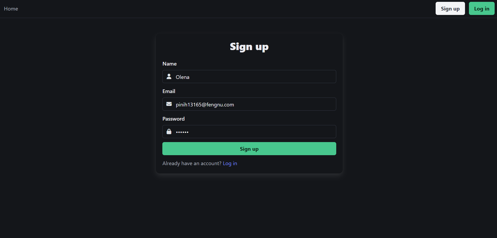
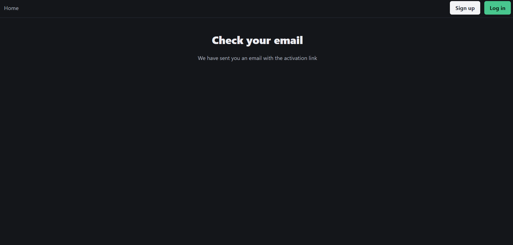
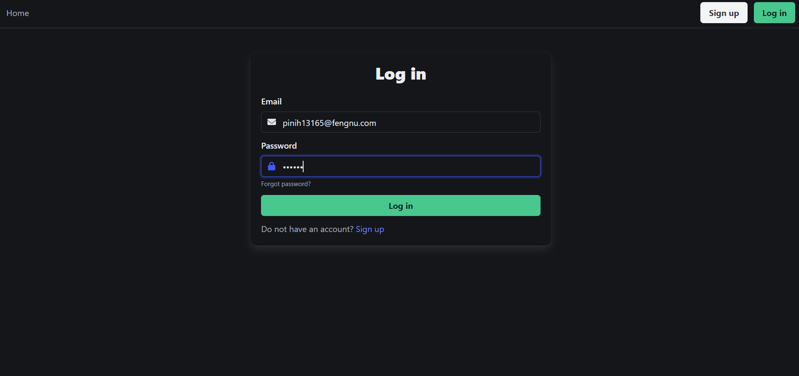

---

### 📩 2. Email Activation
- User receives an email with an activation link  
- The link contains a **unique activation token**  
- Account must be activated before login is allowed  

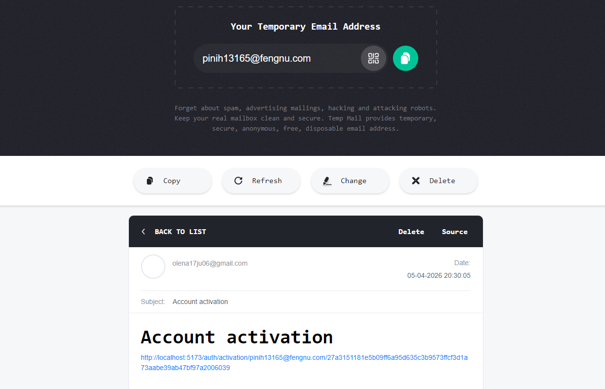

---

### 🔐 3. Account Activation
- Backend verifies the activation token  
- If valid → account is activated  
- Backend returns an **access token**  
- User is redirected to the **profile page**

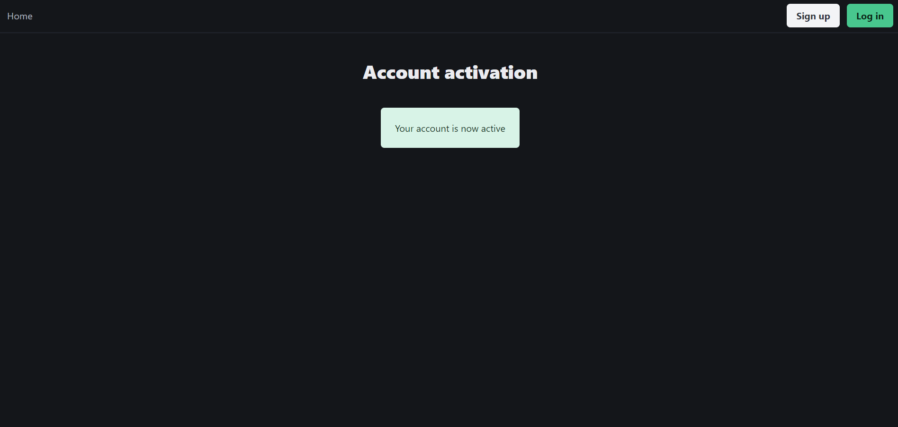

---

### 🏠 4. Protected Profile Page
- Accessible only with a valid access token
- If token is missing or invalid → redirect to login

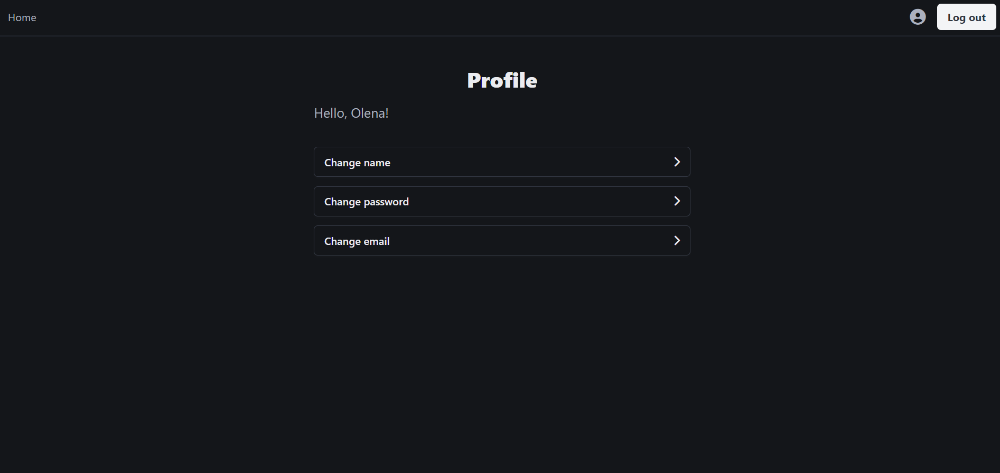

👉 Available actions:
- Update name

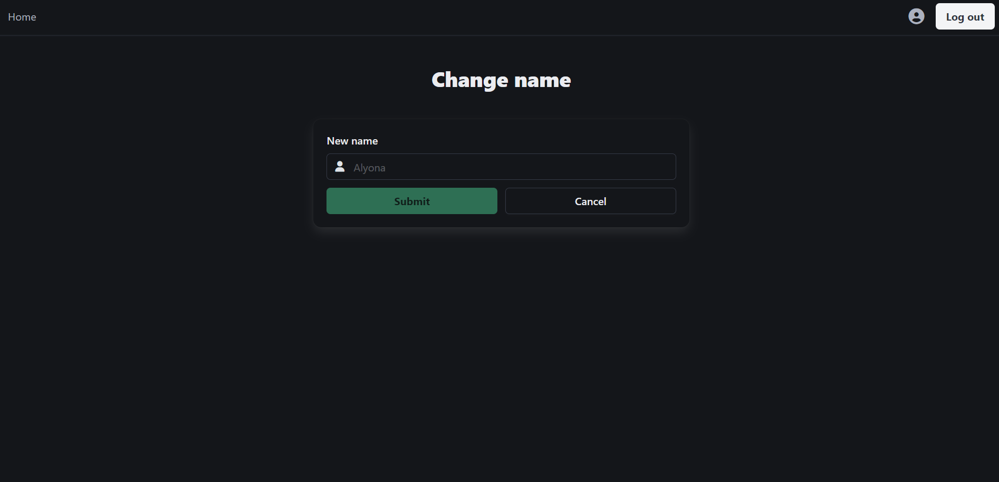

- Change password

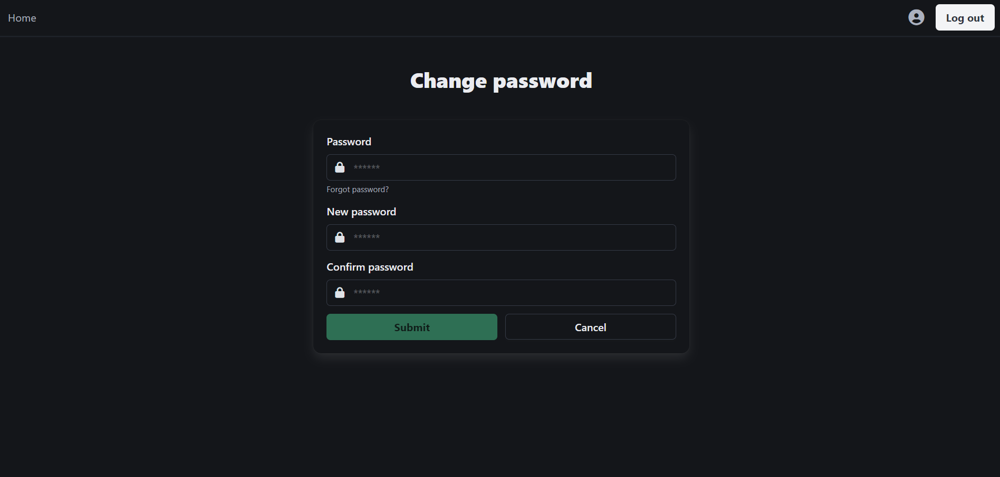

- Change email

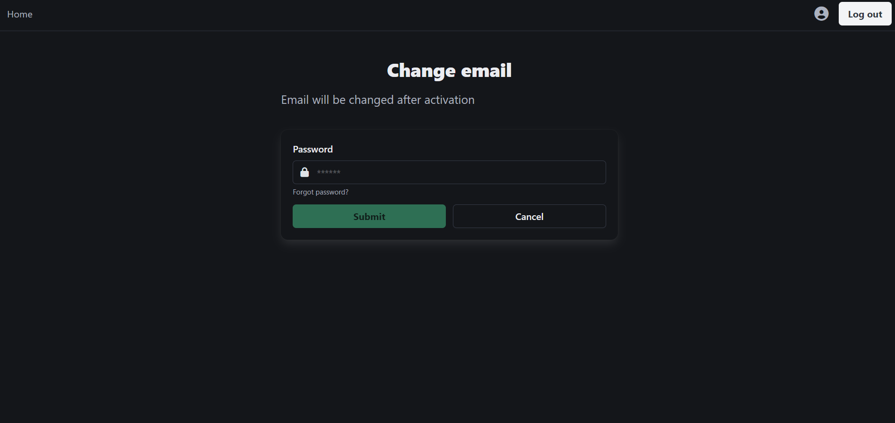
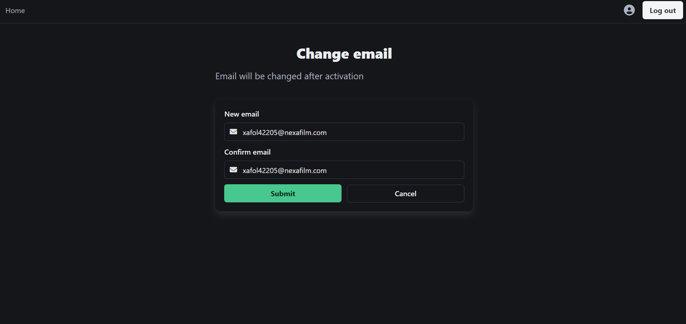
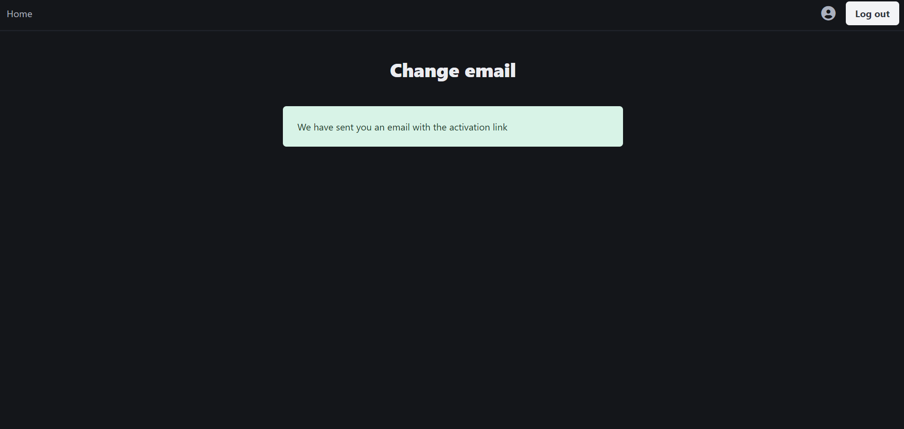
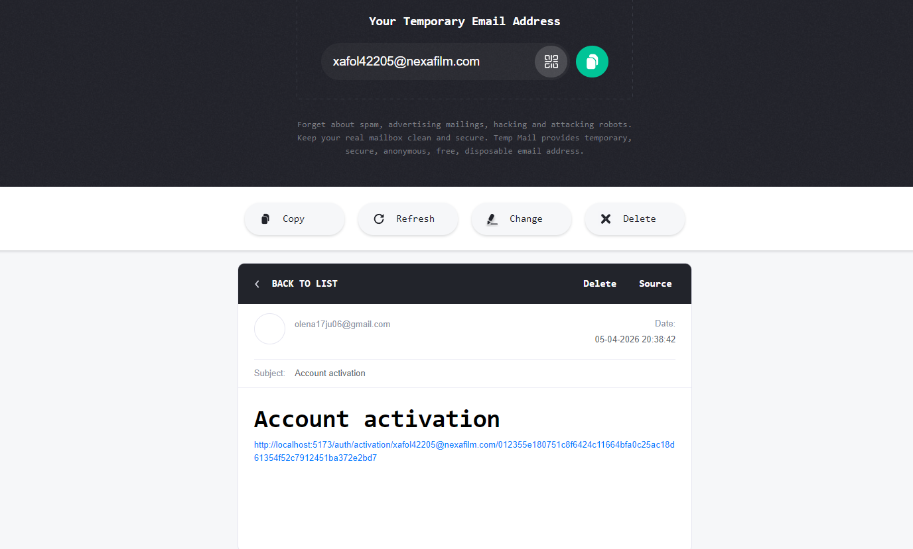
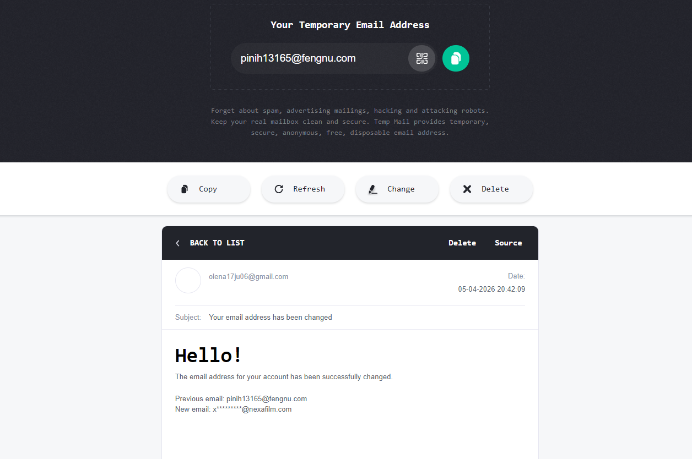

- Logout


---

### 🔄 5. Token Refresh Flow
- On app load (`useEffect` in App):
  - request is sent to `/refresh`
  - server:
    - validates refresh token (stored in HTTP-only cookies)
    - generates new access token
    - updates refresh token in cookies

👉 ensures:
- persistent sessions
- secure authentication 

---

### 🔑 6. Password Reset (Forgot Password)
- If user is authenticated → email is sent automatically
- If not → user provides email manually

👉 email contains reset token for password recovery

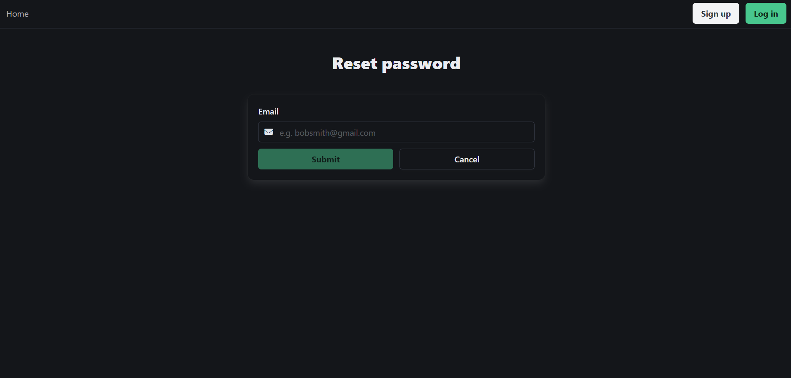
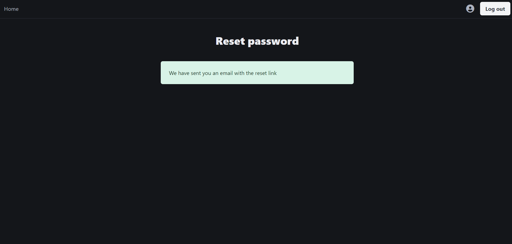
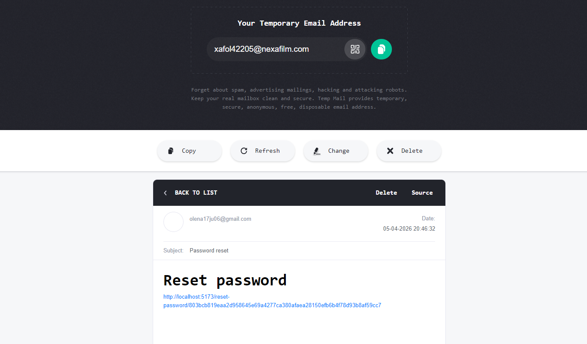

---

### 🚪 7. Logout
- Clears tokens from localStorage  
- Ends session securely  


---

## 🔗 Backend Repository

https://github.com/alyonashunevych/fullstack-auth-app-backend

---

## 🛠 Tech Stack

**Frontend**
- React (TypeScript)
- SCSS
- React Router

**Backend**
- Node.js
- Express
- PostgreSQL

**Auth & Security**
- JWT (access + refresh tokens)
- HTTP-only cookies
- Password hashing

---

## ✨ Features

- Full authentication flow (email verification required)
- JWT-based authorization (access + refresh tokens)
- Protected routes
- Password reset via email
- Profile management
- Persistent sessions

---

## ⚠️ Email & Deployment Note

Email functionality (account activation & password reset) works correctly **in local environment**.

However, during deployment, several limitations were encountered:

- Free email services (SMTP / APIs) require:
  - domain verification  
  - sender authentication (DKIM, DMARC)  
- Some services may suspend accounts without a verified domain  
- Gmail SMTP is unreliable on cloud platforms (e.g. Render) due to networking restrictions  

👉 Because of this, email delivery is **not fully functional in the deployed version**.

📌 The full email flow can be tested locally and is fully implemented in the codebase.

---

## 🚀 Run locally

```bash
git clone https://github.com/alyonashunevych/fullstack-auth-app.git
cd fullstack-auth-app
npm install
npm start
```

## 👤 Author

https://github.com/alyonashunevych
